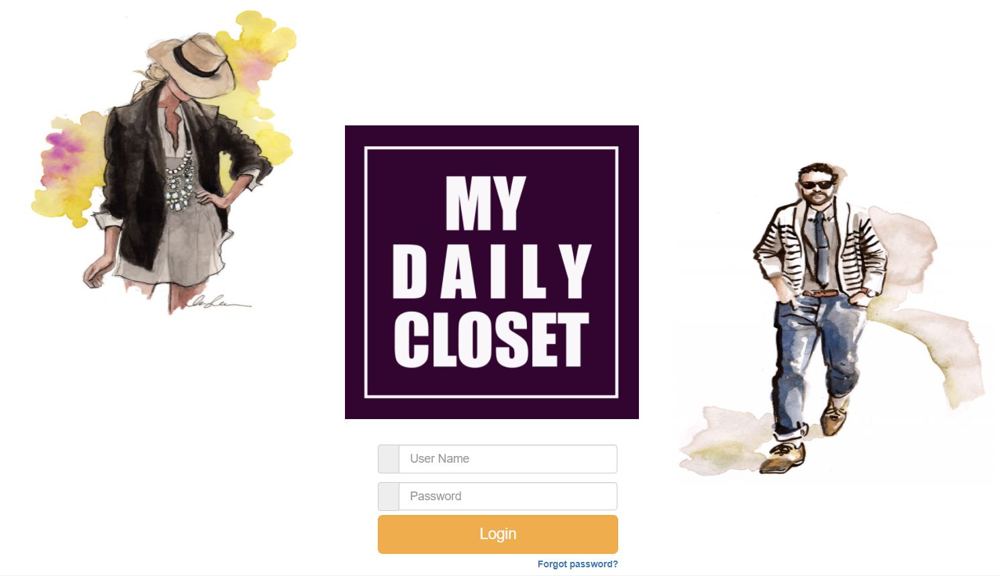
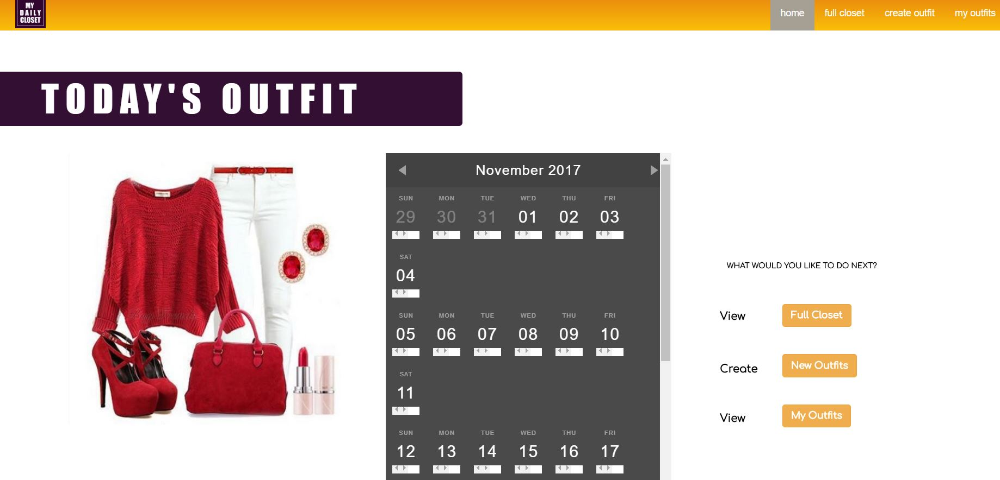
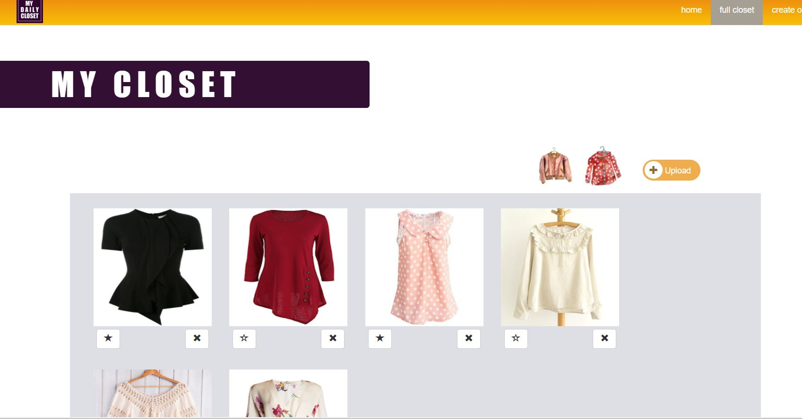
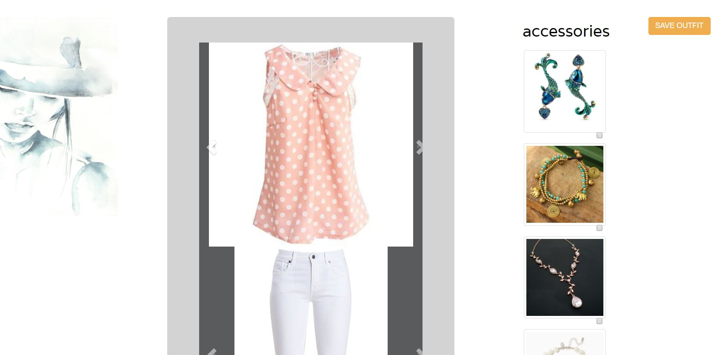
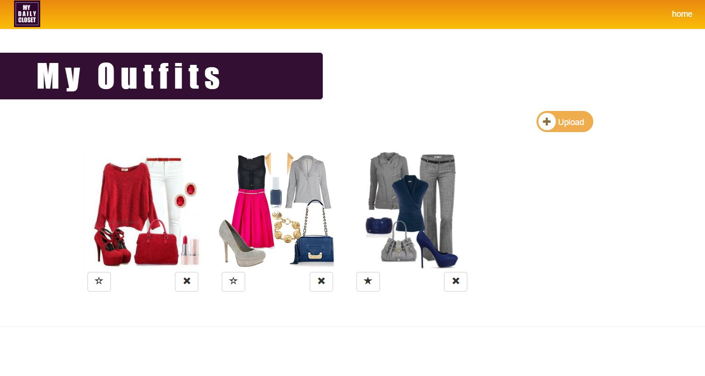

# MyDailyCloset
This is a closet organizer app that allows users to upload photos of their clothes in order to organize them and create new outfits from their clothes.

## Overview

### Login Page

*To view our application in action, please use either of these preset usernames and passwords:
-User Name: Darnell   Password: pw1
-User Name: Reyna     Password: pw2

*To-Do - Implement new user login

### Home Page

*The Home page displays a calendar and pulls an outfit image from the saved outfits in the database.

*To-Do - Need functionality to add notes to calendar

### Closet Page

*On this page the user can upload images from their device under 1 of 4 categories: tops, bottoms, shoes, accessories.
When a new image is uploaded, this is saved to Filestack API and to a database. User can 'favorite' or 'delete' each item 
to update them in the database

### Create New Outfit Page

*On this page their is a carousel to help users to view their clothing items together and brainstorm new and exciting outfits.

*To-do: Add functionality to checked accessories.
*To-do: 'Save Outfit' button not yet functional. It will be used to save a screenshot of selected items and accessories.

### View Saved Outfits Page

*This is a view of all saved outfits.  The user is able to upload images of themselves from their device. 
When a new image is uploaded, this is saved to Filestack API and to a database. User can 'favorite' or 'delete' each item 
to update them in the database

## Authors

* **Reyna Perez** 
* **Darnell Willis** 
* **Trent Cooper** 
* **Bethany Pfeister** 

## Acknowledgments

* UA Programming Bootcamp
